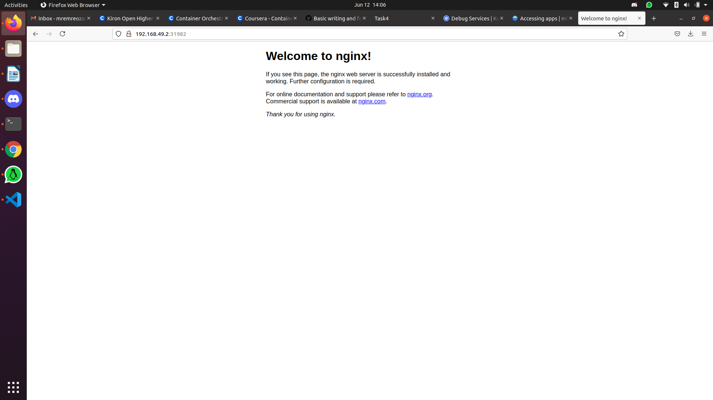
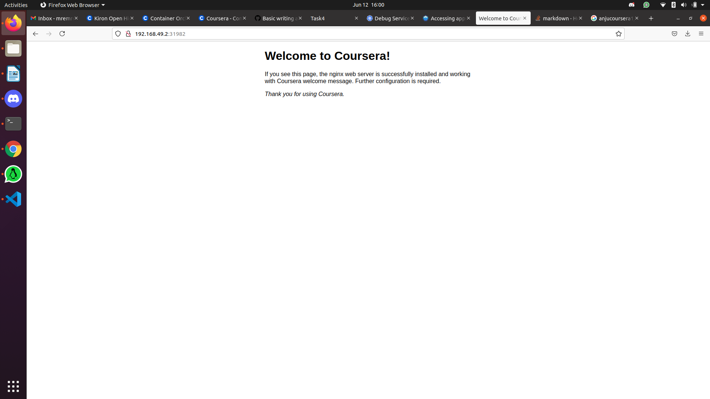

    Markdown: Open Preview to the Side command (Ctrl+K V).
# 1. Create a pod (nginx_pod.yml)
NOTE: Check if you are using tabs for indentation. YAML doesn't allow tabs; it requires spaces.
```bash
apiVersion: v1
kind: Pod
metadata: 
  name: my-nginx-pod
spec:
  containers:
    - name: my-nginx
      image: nginx
```
# 2. Start minikube cluster
```bash
minikube start
```
# 3. Lets deploy our pod to Minikube
NOTE: don't use sudo
```bash
kubectl apply -f nginx_pod.yml
```
### To see the pods
```bash
kubectl get pods
```
## 4. Create replicas of the pod (nginx_rc.yml)
NOTE: spec->template->metadata->name : we write the name of the pod here.
```bash
apiVersion: v1
kind: ReplicationController
metadata: 
  name: my-nginx-rc
spec:
  replicas: 10
  selector:
    app: nginx
  template: 
    metadata:
      name: my-nginx-pod
      labels:
        app: nginx
    spec: 
      containers:
        - name: nginx
          image: nginx
```
### Create replicas
```bash
kubectl apply -f nginx_rc.yml
```
### To see replication controller
```bash
kubectl get rc
```
### To see replication controllers pods
```bash
kubectl get pods -l app=nginx
```
### To delete replication controllers pods
```bash
kubectl delete pods -l app=nginx
```
#### But if you delete all pods, it creates replica pods again. (Self-healing)
## 5. How to make the Pods available on the network by using a Service resource type (nginx_service.yml)
```bash
apiVersion: v1
kind: Service
metadata: 
  name: my-nginx-service
spec:
  type: NodePort
  ports:
    - port: 80
  selector:
    app: nginx
```
### Create a service
```bash
kubectl apply -f nginx_service.yml
```
### To see services
```bash
kubectl get svc
```
### To find the ip of the service
```bash
minikube service --url my-nginx-service
```
### If you type this ip on your browser, you see the application

# 6. Deployments (nginx_deployment.yml)
Deployments help us to perform rolling updates and rollbacks. We can think that it log every steps.
```bash
apiVersion: apps/v1
kind: Deployment
metadata:
  name: nginx-deployment
spec:
  replicas: 3
  selector:
    matchLabels:
      app: newnginx
  template:
    metadata:
      labels:
        app: newnginx
    spec:
      containers:
        - name: my-nginx
          image: nginx
          ports: 
            - containerPort: 80
```
### Create a deployment
```
kubectl apply -f nginx_deployment.yml
```
### To see all deployment on kubernetes.
```
kubectl get deployment
```
# 7. The best important part: Thanks to deployment, it's possible to update pods or application. (UPDATE)
Note: We created an architecture and We will change the container inside the pod. Finally we will see the result on the browser
### We will change app name in the service.yml to connect the service and deployment. Because updated app's name will be 'newnginx'. And It was written like that on the deployment.yml
```
apiVersion: v1
kind: Service
metadata: 
  name: my-nginx-service
spec:
  type: NodePort
  ports:
    - port: 80
  selector:
    app: newnginx
```
### Update the configuration of the service
```
kubectl apply -f nginx_service.yml
```
### If you see the services on the kubernetes, you see that our service's name and port number don't change. 
```
kubectl get svc
```
### Change the image name in the deployment.yml
Replace 'nginx' to 'anjucoursera1/nginxcourseraapp'
```
apiVersion: apps/v1
kind: Deployment
metadata:
  name: nginx-deployment
spec:
  replicas: 3
  selector:
    matchLabels:
      app: newnginx
  template:
    metadata:
      labels:
        app: newnginx
    spec:
      containers:
        - name: my-nginx
          image: anjucoursera1/nginxcourseraapp
          ports: 
            - containerPort: 80
```
### Update the configuration of the deployment
```
kubectl apply -f nginx_deployment.yml
```
### If you type same ip on your browser, you see the updated application (http://192.168.49.2:31982/)

# 8. Turn into previous version (ROLLBACK)
### To see history of the deployment
```
kubectl rollout history deploy nginx-deployment
```
### If you see the special version like "1"
```
kubectl rollout undo deploy nginx-deployment --to-revision=1
```
### ### If you type same ip on your browser, you see the previous application page. Because we turn inti previous version. (http://192.168.49.2:31982/)

# 9. Delete all pods and services in the namespace (my namespace name is default)
```
kubectl -n default delete pod,svc --all
```
# 10. Other useful commands for kubernetes:
```
curl `minikube service -n <namespace-name> <service-name> --url`
kubectl get namespace
kubectl get svc
kubectl get pods
kubectl get deployment
minikube ip
kubectl describe service <service-name>
kubectl describe nodes <nod-name>
kubectl describe pods <pod-name>
kubectl get all -A
```